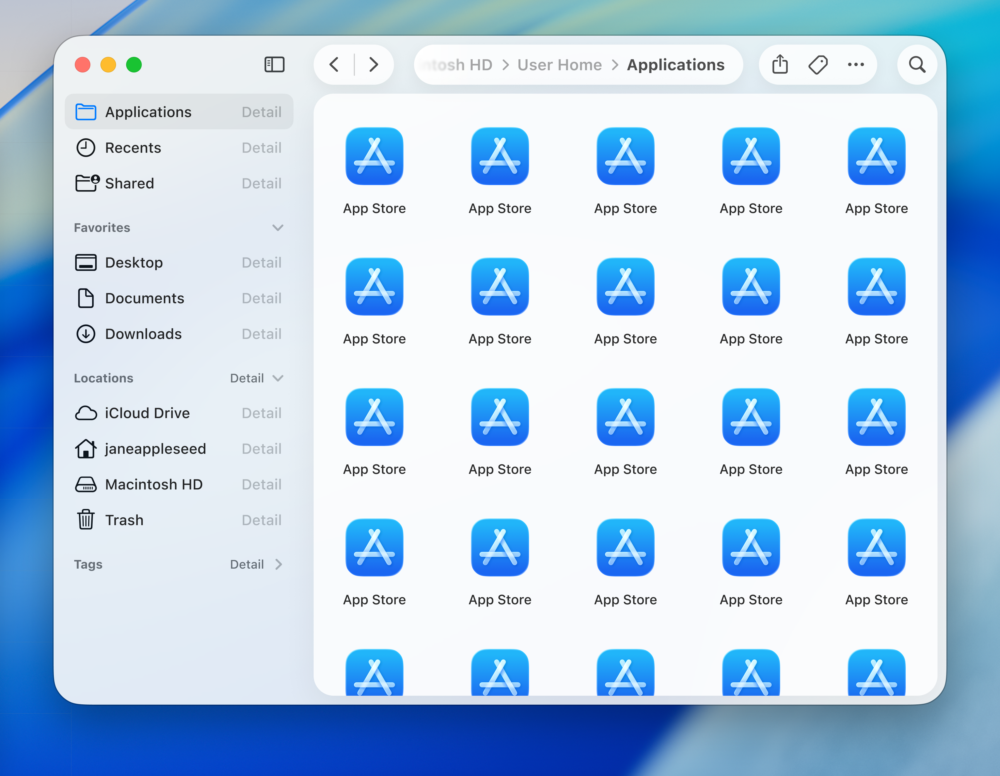
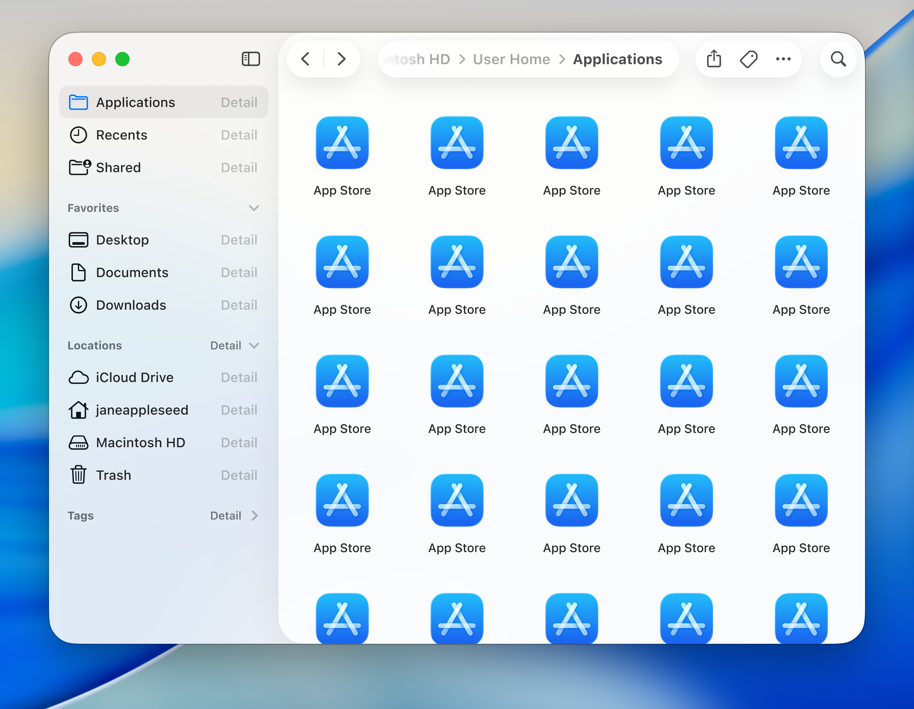

## Liquid Glass isn't actually that bad...
I would say I'm more of a fan of Apple's new Liquid Glass design than most people. I love how it's more padded, rounded, and brings greater focus to the content (for the most part). Apple's previous design language was starting to feel dated, and it felt like it wasn't designed for our world of round mobile displays with everything being a solid, unrounded bar. 

However, the glass material itself is a problem (this is what everyone has been talking about). It really needs more blur; I have noticed way too many cases where body text is readable underneath a toolbar item. On macOS however, it's so much worse. It just doesn't work and it's like it hasn't been thought out at all.

## What exactly makes it so much worse on macOS?

On macOS, the main problem I have is to do with the sidebar. It's raised up in front of the main content with a shadow, making it above your main content. 

In terms of hierarchy, this makes zero sense at all. If something is raised above other content, it takes the focus as the main content. A real life version of this is a stack of papers on a desk. You wouldn't read the paper that's behind other ones, you'd move it to the top of the pile first.

Sidebars are rarely supposed to be the main content. One of the only cases where they are, is when the sidebar is expanded over the main content where the window isn't big enough to show both at the same time, like on mobile devices.

## Experimenting in Figma

I decided to prototype out some ideas in Figma to see what macOS Tahoe would look like without this issue, as this is basically my only problem with it, minus the actual glass material.

I also added back a more traditional path representation, but this could easily just be swapped out for something more abstracted, like what macOS does currently.

### Variant 1

This first variant makes the app itself transparent, and the main content is on a pane with a shadow, elevated above the sidebar, which puts the main content back into focus. The toolbar items aren't on the elevated pane, and I personally find that they're easier to scan through.

### Variant 2

This second variant is the same as the first, except the pane is on the whole right side of the app, containing the toolbar and the main content; it's essentially the inverse of the current design in macOS. One benefit of this is that it shows the relationship between the main content and the toolbar; the toolbar is for actions relating to the main content.

### Both windows, side-by-side

## Thoughts

Personally, I prefer the first variant. It fixes the hierarchy problems whilst not stacking elements too excessively. However the second variant feels more like how Apple usually groups actions to content.
